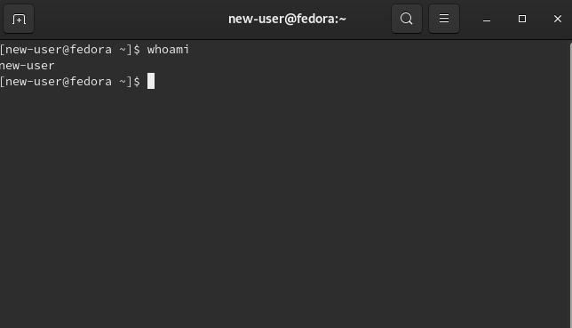

# Ansible role to add new user to system (For Google Code-In)

The role is run with the command `ansible-playbook add.yml`.

A new user is created under the name `new-user` but this can be changed in [roles/add-user/tasks/main.yml](./roles/add-user/tasks/main.yml). The new user is created with no password but this can also be added in the same file.

Below is a recording of the role being executed:

The command `ls /home` returns just one directory before the role was executed - `suhas` (the only user on the system at the time). After the role was executed `ls /home` returned `suhas` and `new-user` which shows that the new user was created.

The image below is a screenshot of the terminal with the new user logged in.

