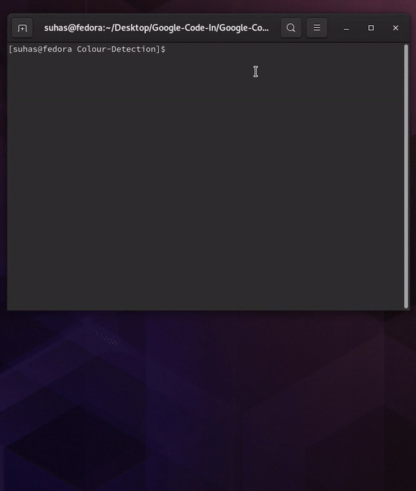

# Colour Detection with Open-CV (For Google Code-In)

The program detects colours in a certain range in an image provided by the user using `OpenCV`. The example below uses [skittles.jpg](./skittles.jpg) and the image is tested on the colour ranges for red, green and yellow. The image is shown with just a single colour range in a separate window. In this window, if the user presses any key, the next colour range is shown.

