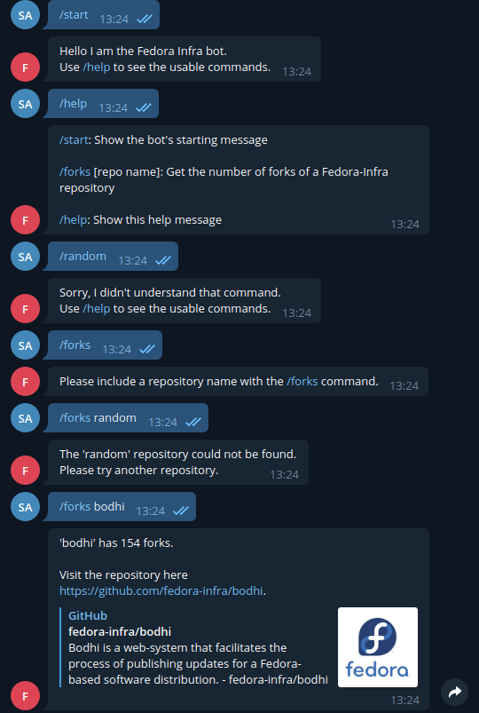

# Fedora Infrastructure Telegram Bot (For Google Code-In)

The bot has the following commands: 
* `/start`
* `/forks [repo name]`
* `/help`

`/forks [repo name]` displays the number of forks of a specific fedora-infra repository on Github. This is done by calling the Github API and scraping the `forks_count` value (as well as the `html_url` so that the user can visit the repository).

The code is in [main.py](https://github.com/suhas-arun/Google-Code-In/tree/master/Fedora-Telegram-Bot/main.py).

Press Ctrl + C to stop the bot.

Below is a conversation with @FedoraInfraBot:

