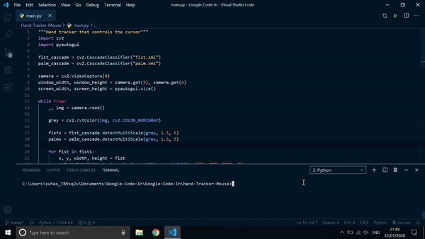

# Hand Cursor (For Google Code-In)

The program uses `Open-CV` and cascade classifiers to detect hands in the webcam feed. It then uses the hand's position to move the mouse cursor (using `PyAutoGUI`). The classifier files are [fist.xml](./fist.xml) and [palm.xml](./palm.xml).

**Move your closed fist to move the cursor. Open your fist to click.**

## Demo

