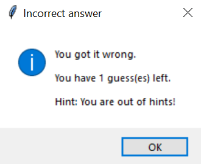
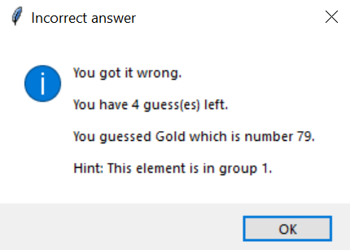

# Periodic table guessing game (For Google Code-In)

Periodic table guessing game made in tkinter. The program uses the csv file [periodic-table.csv](./periodic-table.csv) which contains data on elements 1-112 (113-118 are ommitted as not all the information is available). The csv file contains the following information for each element:

* Atomic Number
* Name
* Symbol
* Atomic Weight
* Group
* Phase
* Type

# GUI

The GUI has a title at the top, the atomic number of the element to guess, an entry box to enter the answer, a submit button, a show answer button, a reset button and an exit button, as below:

# Give Up

When the user clicks the show answer button, a popup window says what the correct answer was, as below:

Then, the full details of the element are shown in a new popup window:

Afterwards, a new element is automatically randomly chosen so the game can continue.

The reset button just chooses a new element without showing the element information.

# Incorrect answers and hints

If the user guesses incorrectly a popup message shows the following:

The user is given 3 hints (one after each incorrect answer) and then for the last guess they don't get a new hint

The hints are:

1. The group number of the element:
2. The type of element:
3. The state of matter at room temperature

After 3 the user is out of hints:

If a player's answer is a valid element but not the right one, the element's name and atomic number are shown:

After the player has run out of guesses, the popup message shows what the element was and another shows the full details of that element.

Then, a new element is randomly chosen so the game can continue.

# Correct answers

The user can type either the corresponding symbol or name for the element based on the atomic number which is displayed.

When the user answers correctly, the following messages show:

Then, a new element is randomly chosen so the game can continue.