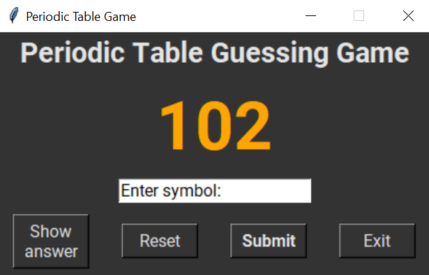
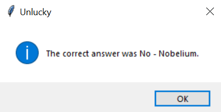
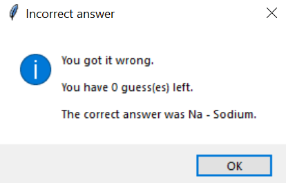

# Periodic table guessing game (For Google Code-In)

Periodic table guessing game made in tkinter. The program uses the csv file [periodic-table.csv](./periodic-table.csv) which contains data on elements 1-112 (113-118 are ommitted as not all the information is available). The csv file contains the following information for each element:

* Atomic Number
* Name
* Symbol
* Atomic Weight
* Group
* Phase
* Type

# GUI

The GUI has a title at the top, the atomic number of the element to guess, an entry box to enter the answer, a submit button, a "give up" button and an exit button, as below:

# Give Up

When the user clicks the "give up" button, a popup window says what the correct answer was, as below:

Then, the full details of the element are shown in a new popup window:

Afterwards, a new element is automatically randomly chosen so the game can continue.

# Incorrect answers and hints

If the user guesses the element incorrectly, a popup says how many guesses are left (out of 5) and then a new popup window shows a hint.

The user is given 3 hints (one after each incorrect answer) and then for the last guess they don't get a new hint

The hints are:

1. The group number of the element:

2. The type of element:

3. The state of matter at room temperature

4. No more hints after 3:

When the player has run out of guesses the following popup messages show up, showing the right answer.

Then, a new element is randomly chosen so the game can continue.

# Correct answers

The user can type either the corresponding symbol or name for the element based on the atomic number which is displayed.

When the user answers correctly, the following messages show:

Then, a new element is randomly chosen so the game can continue.