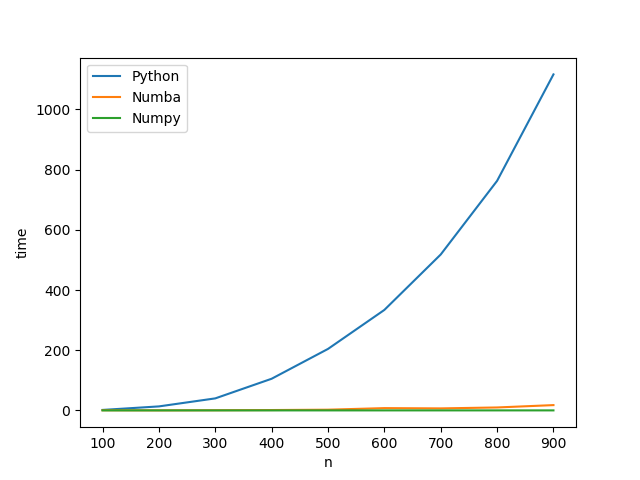

# Time Bound Computation (For Google Code-In)

The program performs matrix multipication of two matrices randomly generated using `np.random.rand(n, n)` for n in `range(100, 1000, 100)`.

Matrix multiplication is carried out using 3 different methods.

1. Standard Python - iterates through both matrices and performs the multiplication step by step, outputting a 2d list.

2. Numba - a just-in-time compiler that uses the LLVM compiler project to generate machine code from Python. In my code, the functions for standard python matrix multiplication and Numba matrix multiplication are identical, except the Numba function is preceded by the decorator `@jit(nopython=True)`. `nopython=True` means that the function is run without the involvement of the Python interpreter, maximising performance.

3. Numpy - I used `numpy.dot()` to calculate the dot product of the two matrices.

Below is the graph showing the time taken for the computation for each method as the dimensions of the matrices, `n` increased.

* The standard python function was by far the slowest of the 3. Numpy was the fastest as it is mostly written in C, which is a lower-level language than Python and is compiled, making it much faster. 

* Numpy functions are also much faster than Python because they take advantage of parallelism (which means that the same operation can be performed on multiple data points at once), which standard Python cannot do.

* Python is a dynamically typed language (as opposed to C which is statically typed) which means that every time a variable is used in Python, its type has to be checked, making the process of looping over the lists very slow. 

* The Numba JIT compiled function was much faster than the standard Python function and almost as fast as the Numpy function. 

* Numba works by reading the bytecode for a function, optimising it, and then using the LLVM compiler to convert it into machine code, specific to the user's CPU capabilities, making the function run much faster than standard Python.

