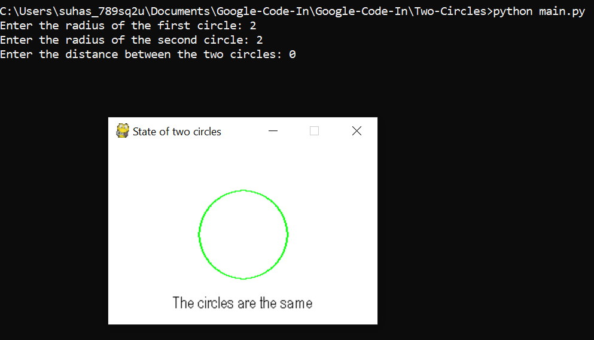
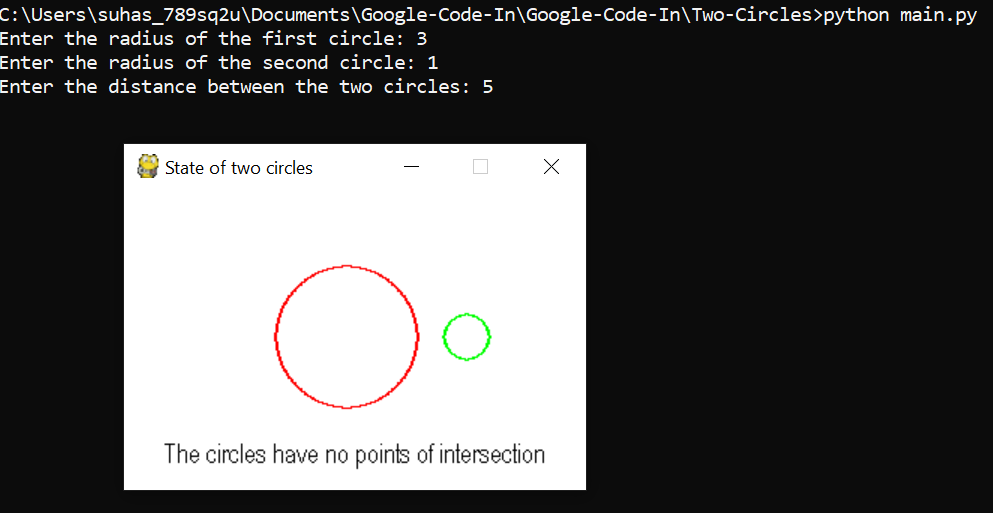
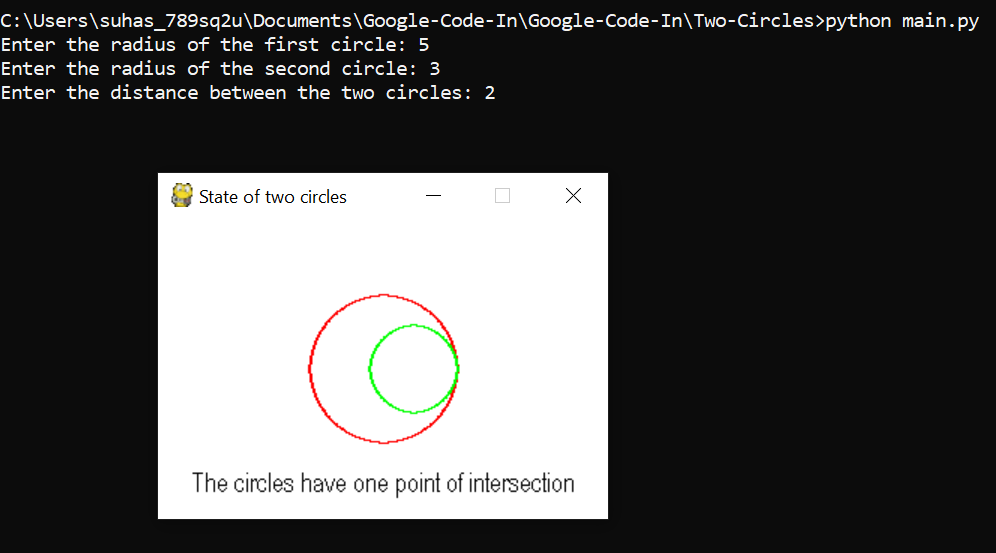
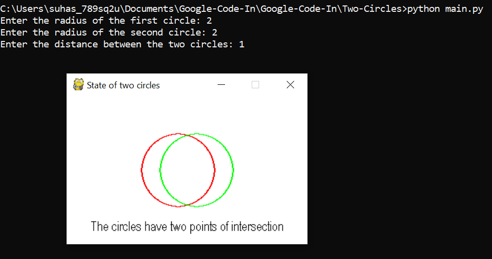

# App that shows the state of 2 circles (For Google Code-In)

The app asks the user to enter the radius of two circles and the distance between their centres and will output the state of the two circles as well as a drawing of the circles using `pygame`.

The state of the two circles can be:
* the same
* concentric
* intersecting once
* not intersecting
* intersecting twice

Below are some screenshots showing the different possible states:

