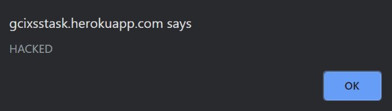
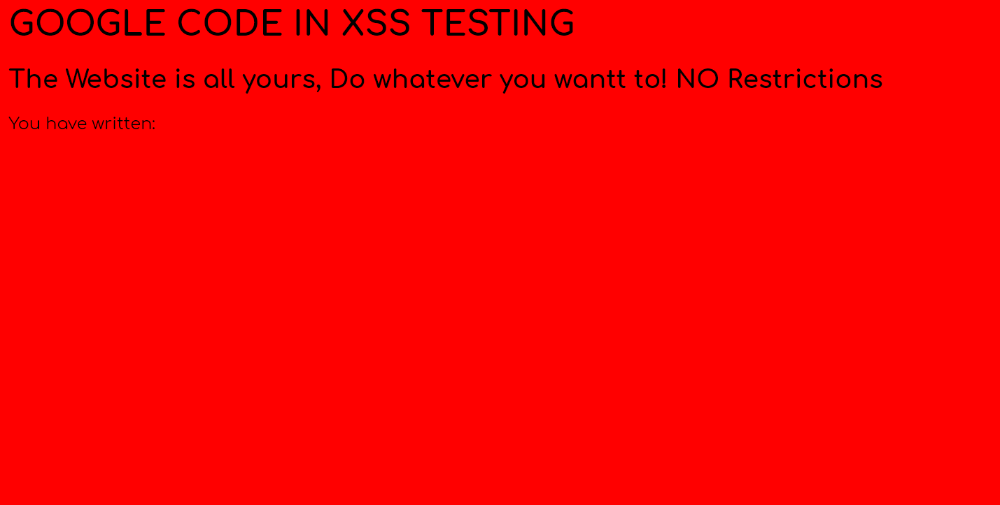

# Detect the XSS Vulnerability (For Google Code-In)

Below are the details of the XSS attacks that I performed on https://gcixsstask.herokuapp.com/ for GCI 2019.

## Create Alert Box

To create an alert box I used the JavaScript `alert()` function. I entered the following code into the input box:

    

## Change Background Colour

I was able to change the background colour by entering `

## Change Background Image

I changed the background image by entering `

## Redirect To Another Website

First I created a website which I hosted on [HTML Pasta](https://htmlpasta.com/) at [this url](https://disclosingchamois.htmlpasta.com/). I added the following html to [index.html](./index.html).

    <!DOCTYPE html>
    <html>
        <head>
            <title>
                HACKED!
            </title>
            
        </head>
        <body>
            <h1>YOU HAVE BEEN HACKED</h1>
        </body>
    </html>

In order to redirect the user to the website, I entered the following in the input box:

    <meta http-equiv="refresh" content="0; url = https://disclosingchamois.htmlpasta.com" />

